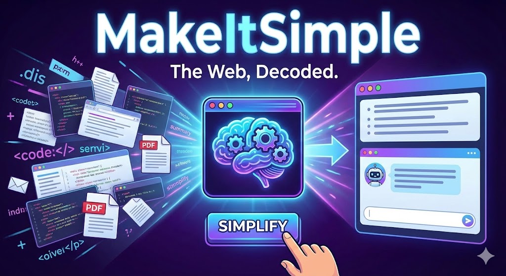
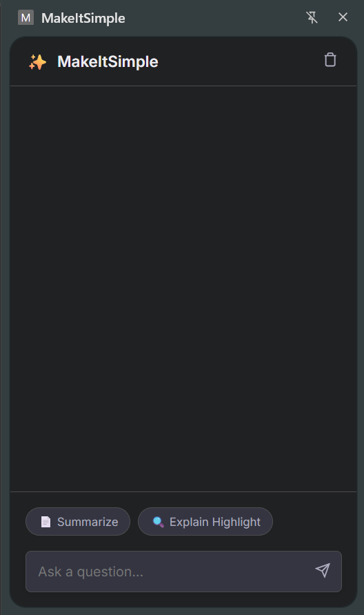

# MakeItSimple

**The Web, Decoded. An AI-powered Chrome Side Panel that summarizes, simplifies, and chats with any webpage or PDF.**




## Overview
MakeItSimple is a Chrome extension powered by Google Gemini 2.5 Flash Lite that acts as your always-on reading companion. Summarize, explain, or chat with any webpage or local PDF (file://) to stay in flow while keeping context front and center.

## Key Features
- 📄 **Instant Summarization:** Get three concise takeaways for any article without leaving the page.
- 🧠 **Explain Like I'm 5:** Highlight text → Right-click → Explain for quick, friendly breakdowns.
- 💬 **Context-Aware Chat:** Ask follow-up questions that stay scoped to the page or PDF you're viewing.
- 📂 **Local PDF Support:** Drag in research papers, contracts, or ebooks and chat with them instantly.
- 🌑 **Modern UI:** Dark mode, glassmorphism styling, and per-tab history so you never lose a thought.

## Tech Stack
- **Frontend:** HTML5, CSS3, Vanilla JS, Chrome Side Panel API
- **Backend:** Node.js, Express (proxy server)
- **AI:** Google Gemini 2.5 Flash Lite
- **Tools:** PDF.js (Mozilla), Marked.js

## Installation & Setup
**Prerequisites:** Node.js ≥ 16, Google Gemini API Key

### Step 1: Clone the Repo
```bash
git clone https://github.com/JayeshSCoder/MakeItSimple
```

### Step 2: Setup Backend
```bash
cd server
npm install
# Create a .env file and add: GEMINI_API_KEY=your_key_here
npm run dev
```

### Step 3: Load Extension
1. Open `chrome://extensions`
2. Enable **Developer Mode** (top right)
3. Click **Load Unpacked** and select the `extension` folder in this repo

### Step 4: Enable PDF Access (Important)
To use PDF chat, locate **MakeItSimple** in your extensions list, open **Details**, and toggle **Allow access to file URLs** to **ON**.

## Screenshots
- 


## Future Roadmap
- Local LLM support (Llama 3)
- Export notes to Notion
- Voice Mode (Text-to-Speech)

## Contributing & License
Pull requests are welcome. For major changes, please open an issue first to discuss what you would like to change.

Licensed under the MIT License.
